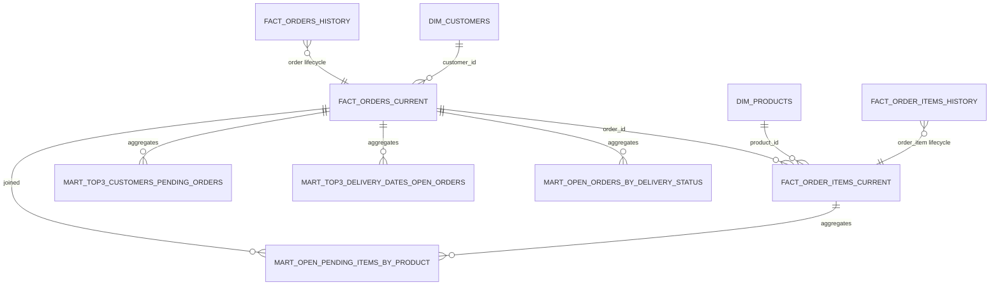

# Analytics Database Structure

## Database
- Name: `analytics_db`
- Schema: `analytics`

## ER Diagram (Logical)

## Tables

### `analytics.dim_customers`
Purpose: current customer dimension attributes.

Columns:
- `customer_id BIGINT PRIMARY KEY`
- `customer_name VARCHAR(500)`
- `is_active BOOLEAN`
- `customer_address VARCHAR(500)`
- `updated_at TIMESTAMP(3)`
- `created_at TIMESTAMP(3)`

### `analytics.dim_products`
Purpose: current product dimension attributes.

Columns:
- `product_id BIGINT PRIMARY KEY`
- `product_name VARCHAR(500)`
- `barcode VARCHAR(26)`
- `unity_price DECIMAL`
- `is_active BOOLEAN`
- `updated_at TIMESTAMP(3)`
- `created_at TIMESTAMP(3)`

### `analytics.fact_orders_current`
Purpose: latest state of each order for near-real-time analytics.

Columns:
- `order_id BIGINT PRIMARY KEY`
- `customer_id BIGINT`
- `order_date DATE`
- `delivery_date DATE`
- `status VARCHAR(50)`
- `updated_at TIMESTAMP(3)`
- `created_at TIMESTAMP(3)`
- `is_open BOOLEAN`
- `is_pending BOOLEAN`

Logical dependency:
- `customer_id` -> `analytics.dim_customers.customer_id`

### `analytics.fact_order_items_current`
Purpose: latest state of each order item.

Columns:
- `order_item_id BIGINT PRIMARY KEY`
- `order_id BIGINT`
- `product_id BIGINT`
- `quantity INTEGER`
- `updated_at TIMESTAMP(3)`
- `created_at TIMESTAMP(3)`

Logical dependencies:
- `order_id` -> `analytics.fact_orders_current.order_id`
- `product_id` -> `analytics.dim_products.product_id`

### `analytics.fact_orders_history`
Purpose: append-only order CDC history.

Columns:
- `event_id BIGSERIAL PRIMARY KEY`
- `order_id BIGINT NOT NULL`
- `customer_id BIGINT`
- `order_date DATE`
- `delivery_date DATE`
- `status VARCHAR(50)`
- `op CHAR(1) NOT NULL` (`c`, `u`, `d`, `r`)
- `event_ts TIMESTAMP(3)`
- `ingested_at TIMESTAMP(3) NOT NULL DEFAULT CURRENT_TIMESTAMP`

### `analytics.fact_order_items_history`
Purpose: append-only order item CDC history.

Columns:
- `event_id BIGSERIAL PRIMARY KEY`
- `order_item_id BIGINT NOT NULL`
- `order_id BIGINT`
- `product_id BIGINT`
- `quantity INTEGER`
- `op CHAR(1) NOT NULL` (`c`, `u`, `d`, `r`)
- `event_ts TIMESTAMP(3)`
- `ingested_at TIMESTAMP(3) NOT NULL DEFAULT CURRENT_TIMESTAMP`

### `analytics.mart_open_orders_by_delivery_status`
Purpose: number of open orders by delivery date and status.

Columns:
- `delivery_date DATE NOT NULL`
- `status VARCHAR(50) NOT NULL`
- `open_orders BIGINT NOT NULL`
- `updated_at TIMESTAMP(3) NOT NULL DEFAULT CURRENT_TIMESTAMP`
- `PRIMARY KEY (delivery_date, status)`

Source:
- `analytics.fact_orders_current` filtered by `is_open = TRUE`

### `analytics.mart_top3_delivery_dates_open_orders`
Purpose: top 3 delivery dates with most open orders.

Columns:
- `rank_position INTEGER PRIMARY KEY`
- `delivery_date DATE`
- `open_orders BIGINT NOT NULL`
- `updated_at TIMESTAMP(3) NOT NULL DEFAULT CURRENT_TIMESTAMP`

Source:
- `analytics.fact_orders_current` filtered by `is_open = TRUE`

### `analytics.mart_open_pending_items_by_product`
Purpose: open pending items by product.

Columns:
- `product_id BIGINT PRIMARY KEY`
- `pending_items BIGINT NOT NULL`
- `updated_at TIMESTAMP(3) NOT NULL DEFAULT CURRENT_TIMESTAMP`

Source:
- `analytics.fact_order_items_current` joined with `analytics.fact_orders_current`
- Filter condition: `analytics.fact_orders_current.is_pending = TRUE`

### `analytics.mart_top3_customers_pending_orders`
Purpose: top 3 customers with most pending orders.

Columns:
- `rank_position INTEGER PRIMARY KEY`
- `customer_id BIGINT`
- `pending_orders BIGINT NOT NULL`
- `updated_at TIMESTAMP(3) NOT NULL DEFAULT CURRENT_TIMESTAMP`

Source:
- `analytics.fact_orders_current` filtered by `is_pending = TRUE`

## Indexes

- `idx_fact_orders_current_open` on `analytics.fact_orders_current (is_open, is_pending)`
- `idx_fact_orders_current_delivery_date` on `analytics.fact_orders_current (delivery_date)`
- `idx_fact_items_current_order` on `analytics.fact_order_items_current (order_id)`
- `idx_fact_items_current_product` on `analytics.fact_order_items_current (product_id)`

## Constraint Strategy

Physical foreign keys are not enforced in the current DDL. Relationships are maintained logically in the pipeline to keep streaming writes simple and resilient.
