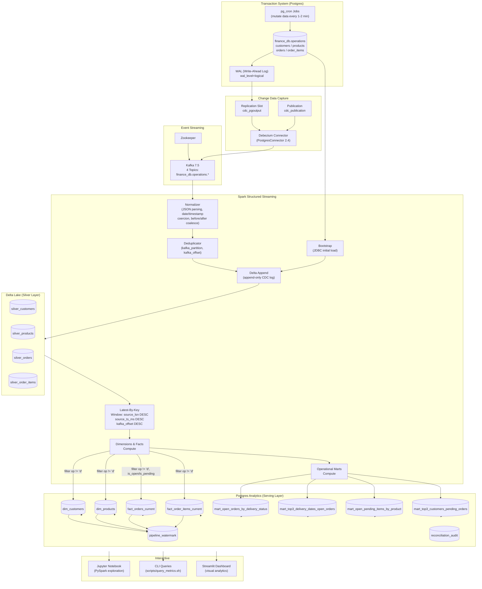
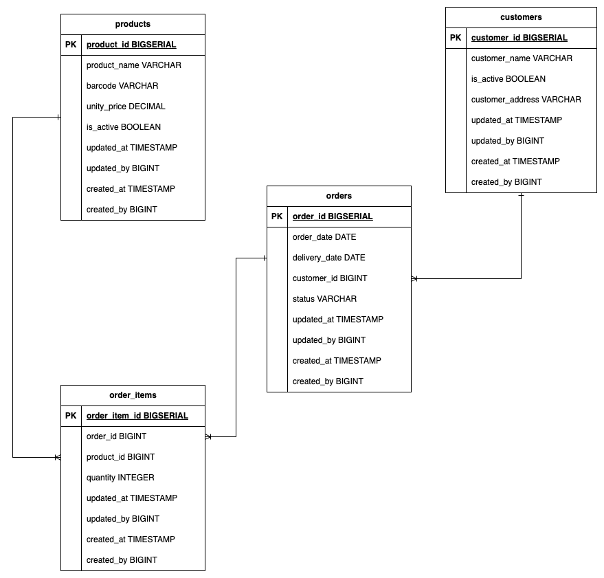
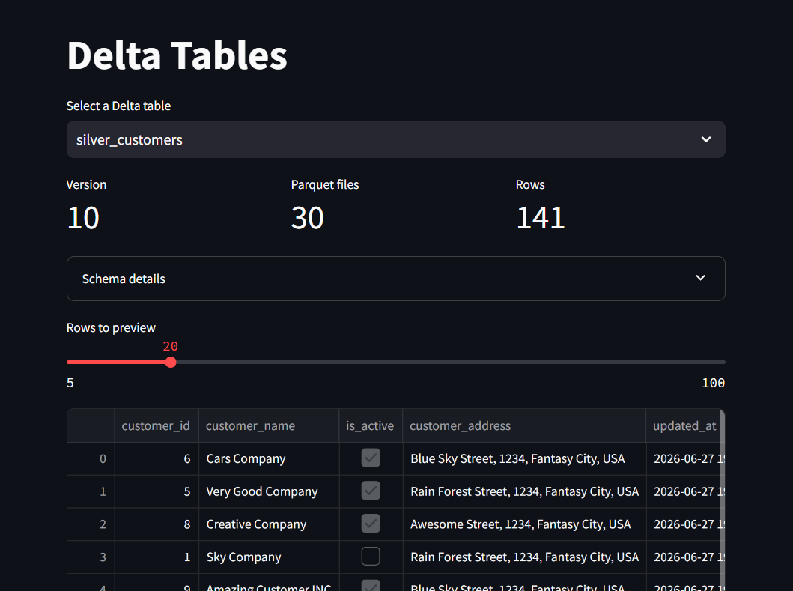
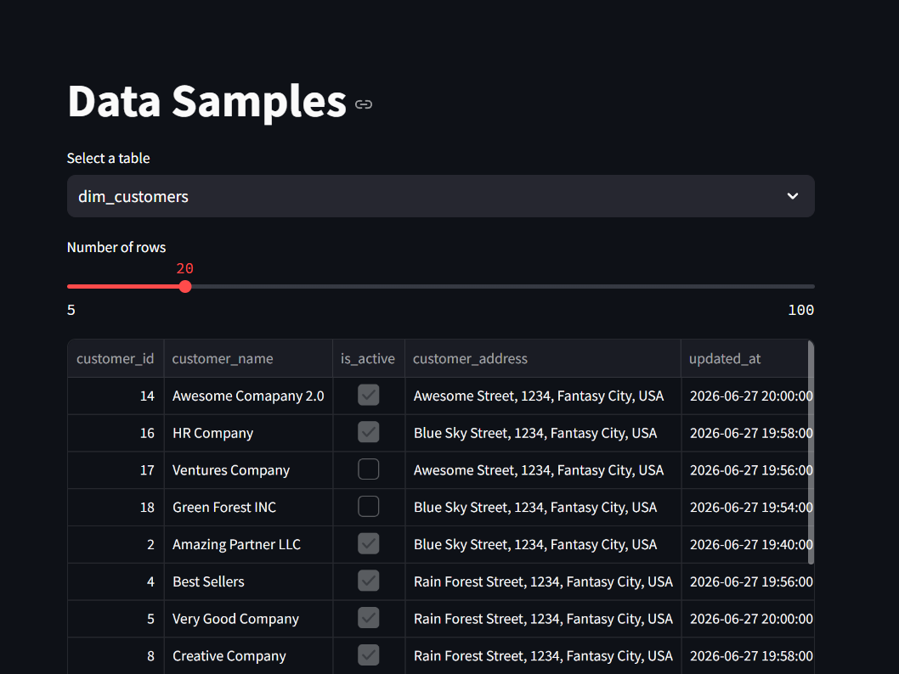
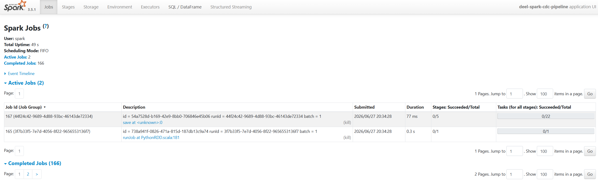
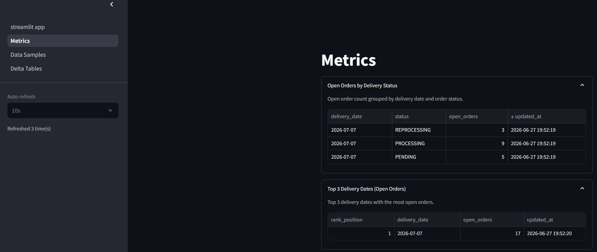
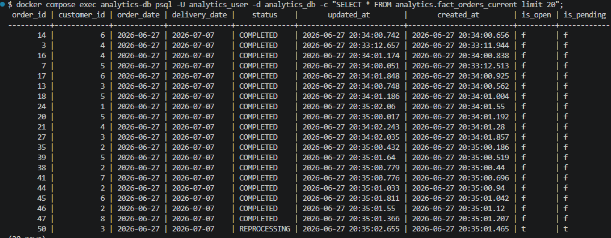

# DEEL Spark Take-Home — Online Analytics Pipeline

This project implements a **CDC-driven real-time analytics pipeline**. All
processing — dimensions, facts, and operational marts — is computed inside
**Apache Spark** and only the final serving layer is persisted in **Postgres**.

A **Jupyter PySpark notebook** is included inside the Spark container for
interactive exploration of both CDC streams and the final analytics tables.

---

## Architecture



### Why Delta?

Delta Lake provides ACID merge semantics so each micro-batch can safely upsert
the latest CDC state.  The ordering key `source_lsn > source_ts_ms > kafka_offset`
guarantees that **late or replayed CDC events never overwrite newer state**.



## Quick start

```bash
# 1. Build and start the stack
docker compose up -d --build

# 2. Register the Debezium connector
docker compose run --rm debezium-init

# 3. Run the streaming pipeline
./scripts/run_pipeline.sh

# 4. (Optional) query metrics
./scripts/query_metrics.sh open_orders_by_delivery_status
./scripts/query_metrics.sh top3_delivery_dates
./scripts/query_metrics.sh pending_items_by_product
./scripts/query_metrics.sh top3_customers_pending_orders

# 5. (Optional) start the PySpark notebook
./scripts/start_notebook.sh
# Open http://localhost:8888/?token=deel

# 6. (Optional) open the Streamlit dashboard
# Open http://localhost:8501
```

The Spark `run_pipeline.sh` command uses `--packages` to download the required
JVM connectors (Kafka, Delta, Postgres JDBC) at runtime. The first run may take
a few minutes to fetch them; they are cached in `/tmp/ivy-cache` inside the
container.

`run_pipeline.sh` pre-creates Kafka topics so Spark and Debezium never race.

---

## End-to-End Pipeline Flow

### Step 1 — Infrastructure Startup

| Action | Component | Detail |
|---|---|---|
| Start all services | `docker compose up -d --build` | 7 containers: transactions-db, zookeeper, kafka, kafka-connect, analytics-db, debezium-init, spark |
| Source DB initializes | `transactions-db` | Creates `operations` schema with 4 tables; sets `wal_level=logical`; creates replication slot `cdc_pgoutput`; creates publication `cdc_publication`; creates CDC user with replication privileges |
| Seed data loaded | `transactions-db` | Inserts 5 customers, 30 products, 10 orders (~250 order items) via stored procedures |
| Cron jobs scheduled | `transactions-db` (pg_cron) | `update_customers(5)` every 2 min, `update_products(10)` every 2 min, `generate_orders(100)` every 1 min |
| Analytics DB initializes | `analytics-db` | Creates `analytics` schema with 10 tables (4 dim/fact, 4 marts, 2 ops) + indexes |
| Spark container waits | `spark` | Runs `sleep infinity`, ready for `spark-submit` |

### Step 2 — Debezium Connector Registration

| Action | Component | Detail |
|---|---|---|
| Register connector | `debezium-init` (one-shot) | POSTs `finance-db-connector.json` to Kafka Connect API at `kafka-connect:8083` |
| Connector config | Debezium PostgresConnector 2.4 | Host: transactions-db, DB: finance_db, user: cdc_user, slot: cdc_pgoutput, plugin: pgoutput, heartbeat: 10s |
| Topic creation | Kafka | 4 topics auto-created: `finance_db.operations.{customers,products,orders,order_items}` |
| CDC streaming begins | Debezium → Kafka | Every write to `operations.*` tables generates a CDC event with op (c/u/d), before/after images, source.ts_ms, source.lsn |

### Step 3 — Pipeline Bootstrap

| Action | Component | Detail |
|---|---|---|
| Pre-create topics | `run_pipeline.sh` | `kafka-topics --create` for all 4 topics (1 partition, RF=1) |
| Spark session created | `main.py` | App name: `deel-spark-cdc-pipeline`, Delta extensions enabled, 4 shuffle partitions |
| Empty Delta tables ensured | `ensure_silver_tables()` | Creates 4 Delta tables with predefined schemas if they don't exist |
| Bootstrap: JDBC read | `bootstrap_with_spark()` | Reads all 4 tables from source Postgres via Spark JDBC |
| Bootstrap: cast & enrich | `bootstrap_with_spark()` | Renames `quanity`→`quantity`, casts `unity_price` to `decimal(18,2)`, adds `op='r'`, null CDC metadata fields |
| Bootstrap: write to Delta | `merge_or_init()` | Appends initial snapshot to each silver Delta table |

### Step 4 — Continuous Streaming (repeats every 10 seconds)

| Action | Component | Detail |
|---|---|---|
| Read Kafka topic | `topic_stream()` | 4 independent streams: `startingOffsets=earliest`, `failOnDataLoss=false` |
| Normalize CDC JSON | `normalize_*()` functions | Extracts op, before/after fields, timestamps, LSN, partition, offset from Debezium envelope |
| Coalesce before/after | `_coalesce_before_after()` | Uses `before` values on delete (op='d'), `after` values otherwise |
| Handle date types | `normalize_orders()` | Converts epoch-day integers via `date_add(lit("1970-01-01"), days)` |
| Handle timestamp types | `to_timestamp(millis / 1000)` | Converts epoch millis to Spark TimestampType |
| Filter valid ops | `.where(op.isin("c","u","d","r"))` | Drops rows with null key or invalid op |
| Process micro-batch | `process_stream_batch()` | Calls dedupe, append, and refresh in sequence |
| Deduplicate | `dedupe_batch_by_event()` | Removes rows with duplicate `(kafka_partition, kafka_offset)` within batch |
| Append to Delta | `append_to_delta()` | Append-only write to silver table (audit log preserved forever) |
| Refresh analytics | `refresh_analytics_final_layer()` | Full recompute of dims/facts/marts + Postgres write |

### Step 5 — Analytics Materialization (inside `refresh_analytics_final_layer`)

| Action | Detail |
|---|---|
| Read all 4 silver tables | `read_silver()` — reads full Delta table |
| Compute latest-by-key | `_latest_by_key()` — window function: `partitionBy(key_col) orderBy(source_lsn DESC, source_ts_ms DESC, kafka_offset DESC)`, pick row_number=1 |
| Filter deletes | `.where(col("op") != "d")` — exclude deleted entities |
| Compute dimensions | `dim_customers`: 6 columns; `dim_products`: 7 columns |
| Compute facts | `fact_orders_current`: with computed `is_open` (status != COMPLETED) and `is_pending` (IN status PENDING/PROCESSING/REPROCESSING); `fact_order_items_current`: 6 columns |
| Compute marts | `mart_open_orders_by_delivery_status`: group by delivery_date + status; `mart_top3_delivery_dates_open_orders`: top 3 by sum; `mart_open_pending_items_by_product`: sum quantity for pending orders; `mart_top3_customers_pending_orders`: top 3 by pending count |
| Acquire advisory lock | `pg_advisory_xact_lock(424242)` — prevents concurrent stream race condition |
| Write all 8 tables | `write_final_table()` — JDBC overwrite with TRUNCATE + INSERT (preserves DDL) |
| Upsert watermark | `_upsert_watermark()` — per-partition max LSN/offset with ordering guard |

### Step 6 — Querying & Exploration

| Action | Tool |
|---|---|
| Query any mart | `./scripts/query_metrics.sh {metric_name}` — runs parameterized SQL via psql |
| Interactive notebook | `./scripts/start_notebook.sh` — Jupyter at `localhost:8888?token=deel` |
| Full reset | `./scripts/reset.sh` — `docker compose down -v`, removes checkpoints/Delta, rebuilds, restarts |

---

## Data Model

### Source Layer — Postgres `operations` Schema

| Table | Columns | PK | CDC Config |
|---|---|---|---|
| `operations.customers` | `customer_id`, `customer_name`, `is_active`, `customer_address`, `updated_at`, `updated_by`, `created_at`, `created_by` | `customer_id` (BIGSERIAL) | REPLICA IDENTITY FULL |
| `operations.products` | `product_id`, `product_name`, `barcode`, `unity_price`, `is_active`, `updated_at`, `updated_by`, `created_at`, `created_by` | `product_id` (BIGSERIAL) | REPLICA IDENTITY FULL |
| `operations.orders` | `order_id`, `order_date`, `delivery_date`, `customer_id`, `status`, `updated_at`, `updated_by`, `created_at`, `created_by` | `order_id` (BIGSERIAL) | REPLICA IDENTITY FULL |
| `operations.order_items` | `order_item_id`, `order_id`, `product_id`, `quanity`, `updated_at`, `updated_by`, `created_at`, `created_by` | `order_item_id` (BIGSERIAL) | REPLICA IDENTITY FULL |

### Silver Layer — Delta Lake (Append-Only CDC Log)

Common CDC metadata columns appended to every silver table:

| Column | Type | Description |
|---|---|---|
| `op` | String | CDC operation: `c` (create), `u` (update), `d` (delete), `r` (bootstrap read) |
| `event_ts` | Timestamp | Debezium event timestamp (from `$.ts_ms`) |
| `source_ts_ms` | Long | Source DB commit timestamp (from `$.source.ts_ms`) |
| `source_lsn` | Long | Postgres WAL Log Sequence Number (monotonic, from `$.source.lsn`) |
| `kafka_topic` | String | Source Kafka topic name |
| `kafka_partition` | Integer | Kafka partition number |
| `kafka_offset` | Long | Kafka offset within partition |

Each table also carries its domain columns (e.g., `customer_id`, `customer_name`, etc.).



### Serving Layer — Postgres `analytics` Schema

#### Dimension Tables

| Table | Columns | PK | Description |
|---|---|---|---|
| `dim_customers` | `customer_id`, `customer_name`, `is_active`, `customer_address`, `updated_at`, `created_at` | `customer_id` | Current-state customer attributes |
| `dim_products` | `product_id`, `product_name`, `barcode`, `unity_price`, `is_active`, `updated_at`, `created_at` | `product_id` | Current-state product attributes |

#### Fact Tables

| Table | Columns | PK | Description |
|---|---|---|---|
| `fact_orders_current` | `order_id`, `customer_id`, `order_date`, `delivery_date`, `status`, `updated_at`, `created_at`, `is_open`, `is_pending` | `order_id` | Latest state per order; `is_open` = status != COMPLETED; `is_pending` = status IN (PENDING, PROCESSING, REPROCESSING) |
| `fact_order_items_current` | `order_item_id`, `order_id`, `product_id`, `quantity`, `updated_at`, `created_at` | `order_item_id` | Latest state per order item |

#### Operational Marts

| Table | Columns | PK | Business Question Answered |
|---|---|---|---|
| `mart_open_orders_by_delivery_status` | `delivery_date`, `status`, `open_orders`, `updated_at` | `(delivery_date, status)` | How many open orders exist per delivery date and status? |
| `mart_top3_delivery_dates_open_orders` | `rank_position`, `delivery_date`, `open_orders`, `updated_at` | `rank_position` | Which 3 delivery dates have the most open orders? |
| `mart_open_pending_items_by_product` | `product_id`, `pending_items`, `updated_at` | `product_id` | For pending orders, how many total items are ordered per product? |
| `mart_top3_customers_pending_orders` | `rank_position`, `customer_id`, `pending_orders`, `updated_at` | `rank_position` | Which 3 customers have the most pending orders? |

#### Operational Tables

| Table | Columns | PK | Description |
|---|---|---|---|
| `pipeline_watermark` | `stream_name`, `kafka_topic`, `kafka_partition`, `kafka_offset`, `source_ts_ms`, `source_lsn`, `event_ts`, `updated_at` | `(stream_name, kafka_partition)` | Tracks per-partition progress; guards against stale watermark updates via LSN comparison |
| `reconciliation_audit` | `audit_id` (serial), `check_name`, `window_start`, `window_end`, `source_value`, `target_value`, `status`, `detected_at`, `resolved_at`, `details` | `audit_id` | Records consistency check results between source and target |



---

## Streaming semantics

- `startingOffsets=earliest` ensures nothing is missed on first run.
- Each micro-batch is deduplicated by entity key using
  `source_lsn DESC, source_ts_ms DESC, kafka_offset DESC`.
- Delta `MERGE` rejects stale records and applies deletes (`op='d'`).
- Marts are recomputed inside Spark and overwritten to Postgres on every
  micro-batch.

## Scalability roadmap

See [`OPTIMIZATION_SUMMARY.md`](OPTIMIZATION_SUMMARY.md) for a detailed analysis
of billion-row-scale bottlenecks and the planned adaptations (current-state
compaction, incremental marts, hourly snapshots, recovery modes A/B/C, and
health monitoring). Ongoing work is tracked in the
[`feature/spark_streaming_process`](https://github.com/GuilhermeMatsumoto/deel-data-engineering-task/tree/feature/spark_streaming_process)
branch.

## Development

Spark code is bind-mounted from the repository, so edits take effect without an
image rebuild.  Checkpoints live in `.spark-checkpoints/` and Delta tables in
`data/delta/`.

## Notebooks

A sample notebook at `notebooks/exploration.ipynb` demonstrates:

- Creating a `SparkSession` with Delta support
- Reading Delta silver tables

## Best practices

### Medallion Architecture (Bronze → Silver → Gold)

The pipeline follows the medallion architecture pattern:
- **Bronze** (raw data): Kafka topics with raw Debezium JSON
- **Silver** (cleaned, enriched): Append-only Delta Lake tables with normalized schemas, CDC metadata, and deduplication
- **Gold** (aggregated, serving): Postgres dimension/fact tables and pre-computed marts

This layered approach enables auditing, replay, and incremental processing without reprocessing raw data.

### Event Ordering with LSN Chain

| Layer | Protection | Mechanism |
|---|---|---|
| Kafka consumer | `failOnDataLoss=false` | Gracefully handles missing offsets |
| Batch dedupe | `dedupe_batch_by_event()` | Removes duplicate `(kafka_partition, kafka_offset)` |
| Silver append | Append-only, no updates | Every event preserved; never overwritten |
| Latest-by-key | `source_lsn DESC, source_ts_ms DESC, kafka_offset DESC` | Window function picks dominant event |
| Watermark upsert | LSN comparison guard | Rejects stale watermark writes to Postgres |

Postgres LSN is monotonic, persistent in WAL, and propagated untouched by Debezium, making it the ideal ordering key.

### Idempotent Streaming

- **At-least-once delivery** is handled via deduplication on `(kafka_partition, kafka_offset)`
- **Bootstrap + CDC** are merged via append; the initial `op='r'` records coexist with subsequent CDC events
- **Same LSN replayed** (e.g., after topic recreation) is rejected at the latest-by-key window because LSNs match

### Concurrency Safety

| Concern | Solution |
|---|---|
| Multiple streams refreshing Postgres simultaneously | `pg_advisory_xact_lock(424242)` — Postgres advisory lock serializes final layer writes |
| Partial batch failures | `foreachBatch` with checkpointing — Spark resumes from last committed offset |
| Empty batch guard | `_batch_is_empty()` check skips processing when no data |
| Delta table existence | `ensure_silver_tables()` creates empty tables with pre-defined schemas before streaming starts |

### Bootstrap Pattern

Before CDC streaming begins, the pipeline performs a **one-time JDBC read** of all source tables:
- Adds `op='r'` (read) to distinguish bootstrap records from CDC events
- Nulls out CDC metadata fields (no Kafka provenance for bootstrap data)
- Appends to the same Delta tables as CDC data, keeping the full history in one place

This avoids the dual-write problem (initial load + streaming) and provides a unified audit log.

### Data Quality & Hygiene

| Practice | Implementation |
|---|---|
| Schema enforcement | Pre-defined `StructType` schemas for all Delta tables |
| Null handling | `fillna(-1)`, `dropna(subset=[key_col, op])` before processing |
| Type safety | Explicit `.cast("long")`, `.cast("decimal(18,2)")`, `to_timestamp()` |
| Date coercion | Epoch-day integers converted via `date_add(lit("1970-01-01"), days)` — avoids Postgres date parsing pitfalls |
| Rename typos | `quanity` → `quantity` (preserves source data fidelity) |
| Before/after coalesce | Delete events use `before` snapshot; create/update use `after` |

### Operational Visibility

- **Pipeline watermark**: Tracks per-stream, per-partition maximum processed LSN/offset — enables lag monitoring
- **Reconciliation audit table**: Ready for consistency checks between source and target
- **Value column patterns**: All mart tables include `updated_at` timestamps for freshness tracking

### Configuration Externalization

All infrastructure settings are configured via **environment variables** with sensible defaults in `Settings` class:
- Kafka bootstrap servers, DB credentials, checkpoint/Delta paths, JDBC batch sizes
- No hardcoded connection strings in application code
- Docker Compose injects environment variables per service

### Containerized & Portable

- **7 Docker services** orchestrated via Docker Compose
- **Bind-mounted code**: Spark application code mounted from host — edits take effect without rebuild
- **Volume-persisted data**: Postgres data, checkpoints, and Delta tables survive container restarts
- **Git Bash compatibility**: `MSYS_NO_PATHCONV=1` and `MSYS2_ARG_CONV_EXCL="*"` for Windows users
- **CRLF protection**: `.gitattributes` enforces LF line endings for shell scripts

### CDC Infrastructure Best Practices

| Practice | Detail |
|---|---|
| WAL retention | `wal_level=logical` enables row-level change capture |
| Non-drop slot | `slot.drop.on.stop=false` preserves replication slot across restarts |
| Publication scope | `cdc_publication FOR ALL TABLES` captures every schema change |
| CDC user isolation | Dedicated `cdc_user` with minimal required privileges (REPLICATION, SELECT) |
| Heartbeat | 10-second heartbeat interval prevents slot from being dropped during idle periods |
| REPLICA IDENTITY FULL | Ensures Debezium captures the full row state in `before`/`after` |
| Schema-free JSON | `JsonConverter` with `schemas.enable=false` reduces Kafka message size and complexity |
| Decimal as string | `decimal.handling.mode=string` avoids precision loss in CDC transport |

### Resiliency Patterns

| Concern | Mitigation |
|---|---|
| Pipeline crashes | Spark Structured Streaming checkpoints record precise progress per micro-batch |
| Out-of-order events | LSN-based ordering guarantees correct event replay |
| Data source typos | Source column `quanity` is renamed at read time |
| Concurrent execution | Advisory lock serializes Postgres writes; Delta table writes are independent per stream |
| Graceful degradation | Empty batches and null-safe operations (`coalesce`, `dropna`, `fillna`) prevent crashes |

### Driver Memory Configuration

The `spark-submit` command in `scripts/run_pipeline.sh` passes `--driver-memory 4g`.

**Why**: In `local[*]` mode, the Spark driver and executor share a single JVM.
The default 1 GB is insufficient when the pipeline runs four concurrent
streaming queries — each holding Kafka consumer state, Delta transaction logs,
and Postgres JDBC connections — causing the JVM to be silently OOM-killed by
the OS. 4 GB provides adequate headroom for the steady-state workload.

### Postgres Connection Management

The `db_connection()` helper in `delta_manager.py` passes `keepalives=1`,
`keepalives_idle=30`, `keepalives_interval=5`, and `keepalives_count=5` to
`psycopg2.connect()`.

**Why**: The advisory lock must be held across all 8 JDBC table writes to
prevent concurrent streams from racing. The original TRUNCATE-based writes
took `AccessExclusiveLock`, which blocked the dashboard's concurrent
`SELECT` queries (and vice versa). Replaced with `DELETE` (which takes
`RowExclusiveLock` — compatible with concurrent `SELECT`s) followed by
`mode("append")` JDBC writes. TCP keepalives prevent the psycopg2
connection from being dropped during the write window.

## Monitoring

### Spark UI

Access the Spark UI at `http://localhost:4040` to monitor streaming query progress, batch durations, and task metrics.



### Streamlit Dashboard

A Streamlit dashboard is available at `http://localhost:8501` for visualizing analytics data.



### CLI Queries

Query analytics tables directly via `scripts/query_metrics.sh`.



## Reset

```bash
./scripts/reset.sh
```

This clears containers, volumes, checkpoints, and Delta data for a clean run.
